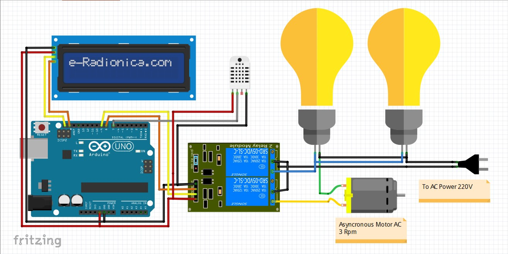

# egg-incubator
## About
  Egg Incubator automation using Arduino (I'm here using Arduino Uno). 
## Materials
  1. The main materials
     * Arduino.
     * DHT11 sensor. 
     * Relay 2 chanel.
     * Lcd 16x2 I2C.
     * Wirings.
     * Fan 12cm.
     * adaptor 12v.
     * asyncronous motor 3 rpm(optional).
     * Light bulb.
  2. Supporting materials
     * Box.
     * Egg rack type apb or the like(optional).
     * Tray for water container.
## Wirring diagram
  
## Galery
  Coming soon...
## Demo Video
  Coming soon...
## Reference
  https://youtu.be/2CpTRhp7vus
